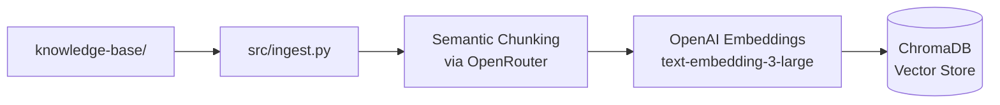
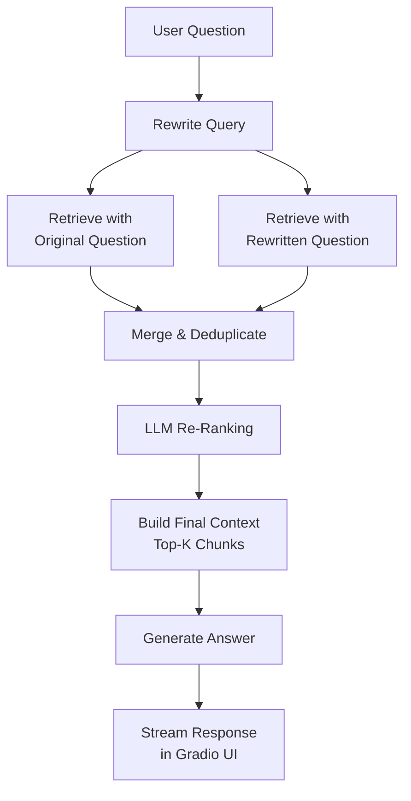
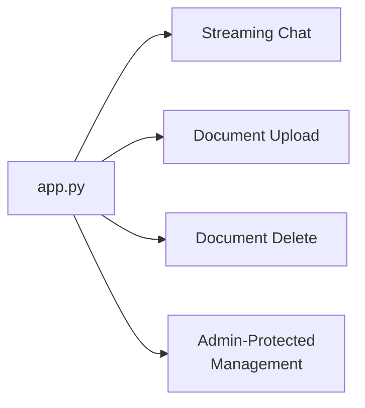

# Advanced RAG Demo - Internal Knowledge Assistant

<p align="center">
  <a href="https://www.youtube.com/watch?v=o2GRJSOT7Yo">
    
  </a>
</p>

<p align="center">
  
  
  
  
  
  
  
</p>

An evaluation-tuned RAG portfolio project built for recruiter-facing demonstration.

This repository contains the `Advanced RAG` version of the project: a production-style internal knowledge assistant with semantic chunking, OpenAI embeddings via OpenRouter, query rewriting, multi-query retrieval, LLM re-ranking, streaming answers, and incremental document management.

In this project, `Advanced RAG` refers to the custom retrieval pipeline implementation, while `LangChain` is kept as the framework baseline.

It was also benchmarked against a separate `LangChain` baseline implementation to show not only that the system works, but that the more advanced retrieval design measurably improves quality.

## Why This Stands Out

- Built a full Advanced RAG system, not just embed -> retrieve -> answer
- Added semantic chunking, query rewriting, multi-query retrieval, and LLM re-ranking
- Included a Gradio app with streaming chat, document upload, delete, and admin-style workflow
- Benchmarked the system against a LangChain baseline and improved it iteratively
- Used evaluation results to tune retrieval strategy instead of relying on intuition alone

## Key Results at a Glance

| Highlight | Result |
|---|---:|
| Retrieval quality (MRR) | `0.9290` |
| Retrieval quality (nDCG) | `0.9247` |
| Keyword coverage | `96.6%` |
| Answer accuracy | `4.79 / 5` |
| Answer completeness | `4.35 / 5` |
| Answer relevance | `4.77 / 5` |
| Improvement over LangChain baseline (MRR) | `+24.8%` |
| Improvement over LangChain baseline (keyword coverage) | `+10.2 points` |

## Demo Video

- YouTube demo: `https://www.youtube.com/watch?v=o2GRJSOT7Yo`
- The video showcases the chat workflow, document management flow, and the overall Advanced RAG product experience.
- The benchmark screenshots later in this README show how the system compares against the LangChain baseline.

## Key Features

### Advanced RAG

- LLM-based semantic chunking with `headline + summary + original_text`
- OpenAI `text-embedding-3-large` embeddings via OpenRouter
- Query rewriting before retrieval
- Multi-query retrieval using both original and rewritten questions
- LLM re-ranking before answer generation
- Top-K tuning for stronger retrieval coverage and answer completeness

### Product-Like Workflow

- Gradio chat interface
- Incremental document upload without rebuilding the full database
- Document listing and deletion
- Password-protected admin actions

### Engineering Focus

- Modular separation between ingestion, answering, and document management
- Configurable model/provider setup via environment variables
- Evaluation-driven iteration using retrieval and answer quality metrics

## Architecture

### Ingestion Pipeline



### Request Flow



### Gradio App



## Advanced RAG vs LangChain

This repository contains the `Advanced RAG` code and also includes a separate `LangChain` baseline in `langchain_baseline/` for direct comparison.

Here, `Advanced RAG` means the custom pipeline implementation rather than the LangChain version.

The LangChain version is intentionally a baseline. LangChain can support many of these advanced techniques too, but I kept that version simpler on purpose. I used it to demonstrate framework familiarity and fast prototyping, while the custom Advanced RAG version was where I implemented and tuned the retrieval logic more explicitly. This gave me clearer control over each step, made benchmarking easier, and helped me measure which retrieval decisions actually improved quality instead of hiding them behind higher-level abstractions.

### Feature Comparison

| Capability | LangChain | Advanced RAG |
|---|---|---|
| Chunking | `RecursiveCharacterTextSplitter` | LLM semantic chunking |
| Embeddings | HuggingFace `all-MiniLM-L6-v2` (384d) | OpenAI `text-embedding-3-large` via OpenRouter (3072d) |
| Query rewriting | No | Yes |
| Multi-query retrieval | No | Yes |
| LLM re-ranking | No | Yes |
| Streaming UI | No | Yes |
| Document management | No | Upload / delete / stats |
| Evaluation usage | Baseline | Tuned using benchmark results |

### Evaluation Results

The latest `Advanced RAG` run in this project achieved:

| Metric | LangChain | Advanced RAG |
|---|---:|---:|
| MRR | 0.7442 | 0.9290 |
| nDCG | 0.7602 | 0.9247 |
| Keyword Coverage | 86.4% | 96.6% |
| Accuracy | 4.05/5 | 4.79/5 |
| Completeness | 3.99/5 | 4.35/5 |
| Relevance | 4.68/5 | 4.77/5 |

### Evaluation Screenshots

#### Retrieval Evaluation

**LangChain - Retrieval**


<p align="center"><em>Baseline retrieval performance using LangChain similarity search.</em></p>

**Advanced RAG - Retrieval**


<p align="center"><em>Advanced RAG retrieval performance after query rewriting, multi-query retrieval, and LLM re-ranking.</em></p>

#### Answer Evaluation

**LangChain - Answer**


<p align="center"><em>Baseline answer quality from the LangChain implementation.</em></p>

**Advanced RAG - Answer**


<p align="center"><em>Answer quality from the Advanced RAG pipeline after retrieval tuning and evaluation-driven iteration.</em></p>

### What Improved the Most

- Always rewriting the query instead of using a conditional heuristic
- Retrieving with both the original and rewritten question
- Re-ranking with richer chunk context before answer generation
- Tuning `RETRIEVAL_K` and `FINAL_K` based on evaluation results

This was the key lesson from the project: retrieval quality improved most when I tuned the retrieval policy itself, not just the answer model.

## Technical Decisions

### Why semantic chunking instead of character-based chunking?

- Character splitting is fast and simple, but it can cut across ideas in awkward places.
- Semantic chunking creates chunks that are more self-contained and more likely to answer a real user question directly.
- Adding `headline + summary + original_text` also improves retrieval quality because the embedding captures both the raw content and a compact semantic description.

### Why OpenAI embeddings via OpenRouter?

- The Advanced RAG pipeline uses `text-embedding-3-large` for stronger retrieval quality.
- This gives a much richer vector representation than the smaller HuggingFace baseline used in the LangChain version.
- OpenRouter keeps the provider setup simple while letting the project use OpenAI-compatible APIs consistently.

### What did evaluation change in the final system?

- It showed that retrieval policy mattered more than I first expected.
- The strongest improvements came from always rewriting the query, retrieving from both query versions, and reranking with richer chunk context.
- In other words, the final system was not just built - it was tuned based on measurable benchmark feedback.

## Prompt Engineering Details

This project relies on four specialized prompts, each designed for a different stage of the RAG pipeline. The overall pipeline and retrieval strategy were iteratively improved based on evaluation metrics.

### 1. Semantic Chunking Prompt (`src/ingest.py`)

- **Pattern:** System-role instruction with structured JSON output
- **Purpose:** Split raw documents into self-contained chunks, each with a `headline`, `summary`, and `original_text`
- **Design choice:** Requiring a headline and summary alongside the original text means the embedding captures both a compact semantic description and the raw content, improving retrieval hit rate
- **Temperature:** `0.3` — low creativity to keep chunking deterministic and reproducible

### 2. Query Rewriting Prompt (`src/answer.py`)

- **Pattern:** Single-turn user prompt with conversation history as context
- **Purpose:** Rewrite the user's question into a search-optimized query before retrieval
- **Design choice:** Always rewriting (not conditional) produced the largest single improvement in MRR during evaluation
- **Temperature:** `0.3` — low variance to keep the rewritten query focused

### 3. Re-Ranking Prompt (`src/answer.py`)

- **Pattern:** System-role instruction with structured JSON output (`{"order": [...]}`)
- **Purpose:** Re-order retrieved chunks by relevance before building the answer context
- **Design choice:** Using structured JSON output instead of free-text ranking ensures reliable parsing and deterministic chunk ordering
- **Temperature:** `0.1` — near-deterministic to keep the ranking stable across runs

### 4. Answer Generation Prompt (`src/answer.py`)

- **Pattern:** System-role prompt with grounded context injection
- **Purpose:** Generate the final answer using only the provided context (grounding)
- **Design choice:** Explicit grounding instruction ("answer only with information supported by the provided context") reduces hallucination and keeps answers verifiable
- **Temperature:** `0.7` — moderate creativity for natural, readable answers

### Prompt Techniques Used

| Technique | Where Applied |
|---|---|
| System / role prompting | All four prompts |
| Structured JSON output | Chunking prompt, re-ranking prompt |
| Context grounding | Answer generation prompt |
| Temperature tuning per task | `0.1` re-rank, `0.3` rewrite/chunk, `0.7` answer |
| Conversation history injection | Query rewriting prompt |

## Cost-Aware Model Selection

| Task | Model | Rationale |
|---|---|---|
| Answer generation | `gpt-4.1` | Best quality for the final user-facing response |
| Semantic chunking | `gpt-4.1` | Needs strong reasoning for accurate document splitting |
| Query rewriting | `gpt-4.1-mini` | Simpler task, smaller model reduces cost without quality loss |
| Re-ranking | `gpt-4.1-mini` | Ordering task with structured output, smaller model is sufficient |

Using cheaper models for sub-tasks (rewrite, rerank) while reserving the strongest model for answer generation and chunking keeps API costs lower without sacrificing end-to-end quality.

## Skills Demonstrated

- **Prompt Engineering:** Designed 4 specialized prompts (chunking, rewriting, reranking, answer generation) using system/role patterns, structured JSON output, and per-task temperature tuning
- **RAG Pipeline Development:** Built a custom retrieval pipeline with semantic chunking, multi-query retrieval, context management, and LLM re-ranking
- **LangChain:** Built a separate baseline RAG implementation for framework comparison and fast prototyping
- **Python & LLM APIs:** OpenAI-compatible API integration with streaming, Pydantic validation, and concurrent processing
- **Vector Search:** ChromaDB for embedding storage and similarity retrieval with OpenAI `text-embedding-3-large`
- **Context Management & Grounding:** Controlled context window size via `RETRIEVAL_K`/`FINAL_K` tuning, grounded answers to retrieved context only
- **Cost Optimization:** Strategic model selection (stronger models for critical tasks, smaller models for sub-tasks) to reduce API cost
- **Evaluation-Driven Pipeline Iteration:** Used MRR, nDCG, keyword coverage, and LLM-judged answer quality to iteratively improve retrieval strategy and pipeline configuration
- **UI Development:** Gradio chat interface with streaming, document management, and admin-protected workflows

## Project Structure

```text
github-repo/
├── app.py
├── src/
│   ├── answer.py
│   ├── ingest.py
│   ├── document_manager.py
│   └── __init__.py
├── langchain_baseline/
│   ├── answer.py
│   ├── ingest.py
│   ├── README.md
│   └── __init__.py
├── knowledge-base/
├── assets/
│   └── evaluation/
│       ├── advanced-rag-answer.jpg
│       ├── advanced-rag-retrieval.jpg
│       ├── langchain-answer.jpg
│       └── langchain-retrieval.jpg
├── docs/
│   └── langchain-vs-advanced-rag.md
├── .env.example
├── .gitignore
├── requirements.txt
└── README.md
```

## Quick Start

### 1. Create a virtual environment

```bash
python -m venv venv
source venv/bin/activate
```

Windows:

```bash
.\venv\Scripts\activate
```

### 2. Install dependencies

```bash
pip install -r requirements.txt
```

### 3. Configure environment variables

Create a `.env` file from `.env.example`, then update it with your provider key and model choices.

Linux/Mac:

```bash
cp .env.example .env
```

Windows:

```bash
copy .env.example .env
```

### 4. Build the Advanced RAG vector database

```bash
python -m src.ingest
```

### 5. Run the Advanced RAG app

```bash
python app.py
```

Then open `http://127.0.0.1:7860`.

### 6. Optional: build and test the LangChain baseline

```bash
python -m langchain_baseline.ingest
python -m langchain_baseline.answer
```

## Environment Variables

| Variable | Purpose |
|---|---|
| `OPENROUTER_API_KEY` | Main API key used by the Advanced RAG pipeline |
| `OPENAI_API_KEY` | Optional direct OpenAI key for alternative setups |
| `OPENAI_BASE_URL` | Base URL for OpenAI-compatible APIs |
| `ANSWER_MODEL` | Final answer model |
| `REWRITE_MODEL` | Query rewriting model |
| `RERANK_MODEL` | Re-ranking model |
| `CHUNKING_MODEL` | Semantic chunking model |
| `LANGCHAIN_LLM_MODEL` | Optional answer model for the LangChain baseline |
| `ADMIN_PASSWORD` | Password for document management actions |

## Example Questions

The knowledge base contains fictional company data about products, employees, contracts, and company culture. Try questions like:

- `What products does the company offer?`
- `What is the company culture like?`
- `Summarize the contracts-related information in the knowledge base.`
- `What benefits are available to employees?`

## Notes

- The knowledge base content is fictional and created for portfolio use.
- The LangChain implementation is included as a comparison baseline in `langchain_baseline/`.
- The vector database should be generated locally and not committed.

## Additional Comparison Notes

See `docs/langchain-vs-advanced-rag.md` for a more explicit breakdown of the design trade-offs and evaluation story.

## Lessons Learned

- **Retrieval quality matters more than the answer model.** Switching from a basic similarity search to a multi-stage retrieval pipeline (rewrite → multi-query → rerank) had a much larger impact on answer quality than changing the LLM alone.
- **Always rewrite the query.** Early versions used a conditional heuristic to decide when to rewrite. Removing the condition and always rewriting improved MRR consistently.
- **Structured output makes prompts more reliable.** Using JSON schemas for chunking and re-ranking eliminated most parsing failures and made the pipeline more robust.
- **Evaluation feedback drives better decisions than intuition.** Several design choices I expected to help (like aggressive top-K filtering) actually hurt quality. Only the benchmark showed this clearly.

## License

MIT License
