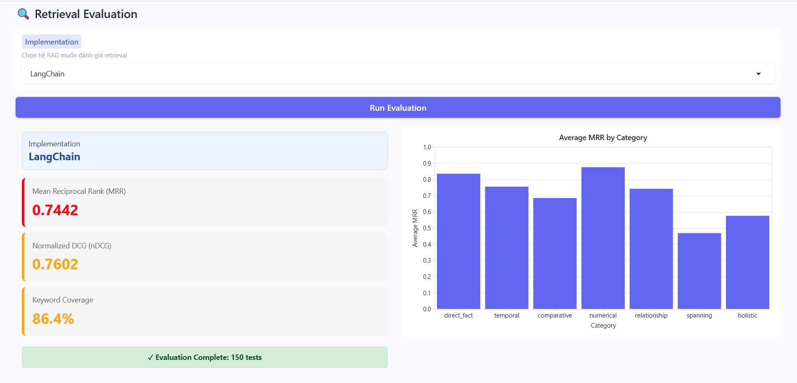
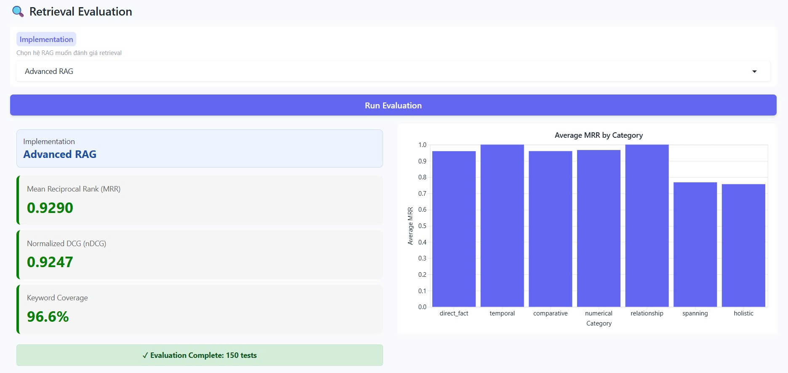
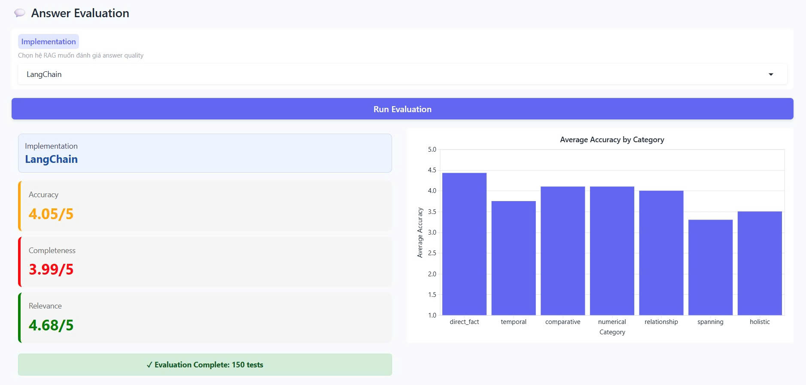
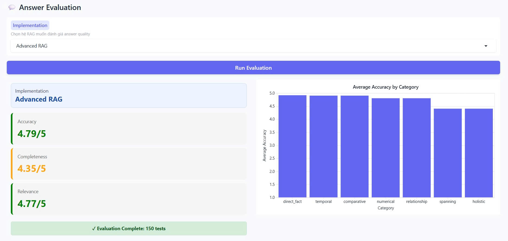

# Advanced RAG Demo - Internal Knowledge Assistant

<p align="center">
  <a href="https://www.youtube.com/watch?v=o2GRJSOT7Yo">
    
  </a>
</p>

<p align="center">
  
  
  
  
  
  
</p>

An evaluation-tuned RAG portfolio project built for recruiter-facing demonstration.

This repository contains the `Advanced RAG` version of the project: a production-style internal knowledge assistant with semantic chunking, OpenAI embeddings via OpenRouter, query rewriting, multi-query retrieval, LLM re-ranking, streaming answers, and incremental document management.

In this project, `Advanced RAG` refers to the custom retrieval pipeline implementation, while `LangChain` is kept as the framework baseline.

It was also benchmarked against a separate `LangChain` baseline implementation to show not only that the system works, but that the more advanced retrieval design measurably improves quality.

## Why This Stands Out

- Built a full Advanced RAG system, not just embed -> retrieve -> answer
- Added semantic chunking, query rewriting, multi-query retrieval, and LLM re-ranking
- Included a Gradio app with streaming chat, document upload, delete, and admin-style workflow
- Benchmarked the system against a LangChain baseline and improved it iteratively
- Used evaluation results to tune retrieval strategy instead of relying on intuition alone

## Demo Video

- YouTube demo: `https://www.youtube.com/watch?v=o2GRJSOT7Yo`
- The video showcases the chat workflow, document management flow, and the overall Advanced RAG product experience.
- The benchmark screenshots later in this README show how the system compares against the LangChain baseline.

## Key Features

### Advanced RAG

- LLM-based semantic chunking with `headline + summary + original_text`
- OpenAI `text-embedding-3-large` embeddings via OpenRouter
- Query rewriting before retrieval
- Multi-query retrieval using both original and rewritten questions
- LLM re-ranking before answer generation
- Top-K tuning for stronger retrieval coverage and answer completeness

### Product-Like Workflow

- Gradio chat interface
- Incremental document upload without rebuilding the full database
- Document listing and deletion
- Password-protected admin actions

### Engineering Focus

- Modular separation between ingestion, answering, and document management
- Configurable model/provider setup via environment variables
- Evaluation-driven iteration using retrieval and answer quality metrics

## Architecture

```text
knowledge-base/
    -> src/ingest.py
       - load markdown files
       - semantic chunking with an LLM
       - OpenAI embeddings via OpenRouter
       - persist to ChromaDB
    -> preprocessed_db/
    -> src/answer.py
       - rewrite query
       - retrieve original + rewritten query
       - merge and deduplicate chunks
       - rerank chunks with an LLM
       - generate final answer
    -> app.py
       - chat UI
       - document upload/delete UI
```

## Advanced RAG vs LangChain

This repository contains the `Advanced RAG` code and also includes a separate `LangChain` baseline in `langchain_baseline/` for direct comparison.

Here, `Advanced RAG` means the custom pipeline implementation rather than the LangChain version.

The LangChain version is intentionally a baseline. LangChain can support many of these advanced techniques too, but I kept that version simpler on purpose. I used it to demonstrate framework familiarity and fast prototyping, while the custom Advanced RAG version was where I implemented and tuned the retrieval logic more explicitly. This gave me clearer control over each step, made benchmarking easier, and helped me measure which retrieval decisions actually improved quality instead of hiding them behind higher-level abstractions.

### Feature Comparison

| Capability | LangChain | Advanced RAG |
|---|---|---|
| Chunking | `RecursiveCharacterTextSplitter` | LLM semantic chunking |
| Embeddings | HuggingFace `all-MiniLM-L6-v2` (384d) | OpenAI `text-embedding-3-large` via OpenRouter (3072d) |
| Query rewriting | No | Yes |
| Multi-query retrieval | No | Yes |
| LLM re-ranking | No | Yes |
| Streaming UI | No | Yes |
| Document management | No | Upload / delete / stats |
| Evaluation usage | Baseline | Tuned using benchmark results |

### Evaluation Results

The latest `Advanced RAG` run in this project achieved:

| Metric | LangChain | Advanced RAG |
|---|---:|---:|
| MRR | 0.7442 | 0.9290 |
| nDCG | 0.7602 | 0.9247 |
| Keyword Coverage | 86.4% | 96.6% |
| Accuracy | 4.05/5 | 4.79/5 |
| Completeness | 3.99/5 | 4.35/5 |
| Relevance | 4.68/5 | 4.77/5 |

### Evaluation Screenshots

#### Retrieval Evaluation

**LangChain - Retrieval**



<p align="center"><em>Baseline retrieval performance using LangChain similarity search.</em></p>

**Advanced RAG - Retrieval**



<p align="center"><em>Advanced RAG retrieval performance after query rewriting, multi-query retrieval, and LLM re-ranking.</em></p>

#### Answer Evaluation

**LangChain - Answer**



<p align="center"><em>Baseline answer quality from the LangChain implementation.</em></p>

**Advanced RAG - Answer**



<p align="center"><em>Answer quality from the Advanced RAG pipeline after retrieval tuning and evaluation-driven iteration.</em></p>

### What Improved the Most

- Always rewriting the query instead of using a conditional heuristic
- Retrieving with both the original and rewritten question
- Re-ranking with richer chunk context before answer generation
- Tuning `RETRIEVAL_K` and `FINAL_K` based on evaluation results

This was the key lesson from the project: retrieval quality improved most when I tuned the retrieval policy itself, not just the answer model.

## Recruiter-Relevant Skills Demonstrated

- Python LLM application development
- Retrieval-Augmented Generation (RAG)
- Prompt design for chunking, rewriting, and reranking
- ChromaDB vector search
- Gradio UI development
- Document ingestion workflows
- Evaluation-driven iteration
- Comparative benchmarking against a baseline implementation

## Project Structure

```text
github-repo/
├── app.py
├── src/
│   ├── answer.py
│   ├── ingest.py
│   ├── document_manager.py
│   └── __init__.py
├── langchain_baseline/
│   ├── answer.py
│   ├── ingest.py
│   ├── README.md
│   └── __init__.py
├── knowledge-base/
├── assets/
│   └── evaluation/
│       ├── advanced-rag-answer.jpg
│       ├── advanced-rag-retrieval.jpg
│       ├── langchain-answer.jpg
│       └── langchain-retrieval.jpg
├── docs/
│   └── langchain-vs-advanced-rag.md
├── .env.example
├── .gitignore
├── requirements.txt
└── README.md
```

## Quick Start

### 1. Create a virtual environment

```bash
python -m venv venv
source venv/bin/activate
```

Windows:

```bash
.\venv\Scripts\activate
```

### 2. Install dependencies

```bash
pip install -r requirements.txt
```

### 3. Configure environment variables

Create a `.env` file from `.env.example`, then update it with your provider key and model choices.

Linux/Mac:

```bash
cp .env.example .env
```

Windows:

```bash
copy .env.example .env
```

### 4. Build the Advanced RAG vector database

```bash
python -m src.ingest
```

### 5. Run the Advanced RAG app

```bash
python app.py
```

Then open `http://127.0.0.1:7860`.

### 6. Optional: build and test the LangChain baseline

```bash
python -m langchain_baseline.ingest
python -m langchain_baseline.answer
```

## Environment Variables

| Variable | Purpose |
|---|---|
| `OPENROUTER_API_KEY` | Main API key used by the Advanced RAG pipeline |
| `OPENAI_API_KEY` | Optional direct OpenAI key for alternative setups |
| `OPENAI_BASE_URL` | Base URL for OpenAI-compatible APIs |
| `ANSWER_MODEL` | Final answer model |
| `REWRITE_MODEL` | Query rewriting model |
| `RERANK_MODEL` | Re-ranking model |
| `CHUNKING_MODEL` | Semantic chunking model |
| `LANGCHAIN_LLM_MODEL` | Optional answer model for the LangChain baseline |
| `ADMIN_PASSWORD` | Password for document management actions |

## Example Questions

- `What products does the company offer?`
- `What is the company culture like?`
- `Summarize the contracts-related information in the knowledge base.`
- `What benefits are available to employees?`

## Notes

- The knowledge base content is fictional and created for portfolio use.
- The LangChain implementation is included as a comparison baseline in `langchain_baseline/`.
- The vector database should be generated locally and not committed.

## Additional Comparison Notes

See `docs/langchain-vs-advanced-rag.md` for a more explicit breakdown of the design trade-offs and evaluation story.

## License

MIT License
